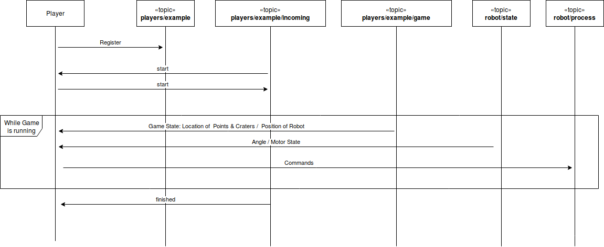

# Interface for Players

## Overview over the available topics

| Topic                             | Direction           | Description                             | Link                     |
| --                                |--                   |--                                       |--                        |
| players/{your_team_name}          | PLAYER_TO_SERVER    | Register player and start games         | [Details](#game-master)  |
| players/{your_team_name}/incoming | SERVER_TO_PLAYER    | Listen if game starts or is finished    | [Details](#game-master)  |
| players/{your_team_name}/game     | SERVER_TO_PLAYER    | Get updates on currently running game   | [Details](#game-state)   |
| robot/state                       | SERVER_TO_PLAYER    | Get current state of robot              | [Details](#robot-state)  |
| robot/process                     | PLAYER_TO_SERVER    | Send commands to robot                  | [Details](#robot-control)|

## Sequence of a game
Before a game starts, you have to register yourself as a player. You do this by sending a
registration message to the topic `players/{teamname}`. The following example uses the
team name `example`. After negotiating the start of the game the game begins and you
receive messages on `players/example/game`.
It's now your turn to control the robot via messages on the `robot/process` topic. After the
game finished you receive a message on `players/example/incoming`.




## <a name="game-master"></a> Communication with the game master

### Registration

To register as a team, you need to send this message to the queue `players/{your teamname}`:

```json
{"command": "register", "args": []}
```

You can send this message every time you connect.

### Game start negotiation

When the game master decides that you are next to play you receive this message
on `players/{your teamname}/incoming`:

```json
{"command": "start", "args": []}
```

If you are ready, you can send the same message back on `players/{your teamname}`:

```json
{"command": "start", "args": []}
```

The gamemaster now starts a new game for you!

### <a name="game-state"></a> Game state

When you are in a running game, you receive the state of the game on the topic
`players/{your teamname}`:

```json
{
    "robot": {"r": 15, "x": 920.0, "y": 750.0},
    "world": {"y_max": 960, "x_max": 1920},
    "points": [
      {"collected": false, "r": 5, "x": 908, "score": 1, "y": 831}
    ]
}
```

## Robot

### <a name="robot-state"></a> Receive state of hardware

```json
{"angle": 100, "left_motor": -143, "right_motor": 345}
```

### <a name="robot-control"></a> Control the robot

#### Topic (Write): robot/process
tbd


    mosquitto_pub -h 127.0.0.1 -t robot/process -m '{"command": "forward", "args": [100]}'

Drive 100 tacho counts forward

    {"command": "forward", "args": [100]}

Drive 50 tacho counts backward

    {"command": "forward", "args": [100]}

#### Topic (Read): robot/done
tbd

#### Topic (Read): robot/state
tbd

    mosquitto_sub -h 127.0.0.1 -t robot/state

    {"angle": 100, "left_motor": -143, "right_motor": 345}

#### Topic (Read): game/state
tbd
