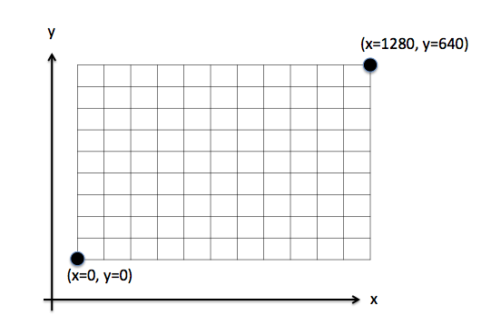
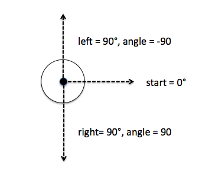

# Interface for Players

The whole communication is over MQTT topics. We use mosquitto version 1.4.10, MQTT Version 3.1 and QOS Level 0 (best effort delivery). For more details about MQTT have a look at the following documentation:


- https://en.wikipedia.org/wiki/MQTT
- http://mqtt.org/
- http://www.hivemq.com/blog/mqtt-essentials-part-1-introducing-mqtt

## Overview over the available topics

| Topic                             | Direction           | Description                             | Link                     |
| --------------------------------- | ------------------- | --------------------------------------- | ------------------------ |
| players/{your_team_name}          | PLAYER_TO_SERVER    | Register player and start games         | [Details](#game-master)  |
| players/{your_team_name}/incoming | SERVER_TO_PLAYER    | Listen if game starts or is finished    | [Details](#game-master)  |
| players/{your_team_name}/game     | SERVER_TO_PLAYER    | Get updates on currently running game   | [Details](#game-state)   |
| robot/state                       | SERVER_TO_PLAYER    | Get current state of robot              | [Details](#robot-state)  |
| robot/process                     | PLAYER_TO_SERVER    | Send commands to robot                  | [Details](#robot-control)|
| robot/error                       | SERVER_TO_PLAYER    | Processing errors form the robot        | [Details](#robot-error)  |


## Sequence of a game
Before a game starts, you have to register yourself as a player. You do this by sending a
registration message to the topic `players/{teamname}`. The following example uses the
team name `example`. After negotiating the start of the game the game begins and you
receive messages on `players/example/game`.
It's now your turn to control the robot via messages on the `robot/process` topic. After the
game finished you receive a message on `players/example/incoming`.


## <a name="game-master"></a> Communication with the game master

### Registration

To register as a team, you need to send this message to the queue `players/{your teamname}`:

```json
{"command": "register"}
```

You can send this message every time you connect.

### Game start negotiation

When the game master decides that you are next to play you receive this message
on `players/{your teamname}/incoming`:

```json
{"command": "start"}
```

If you are ready, you can send the same message back on `players/{your teamname}`:

```json
{"command": "start"}
```

The gamemaster now starts a new game for you!

When the time is over you will receive a finish message on `players/{your teamname}/incoming`:

```json
{"command": "finished"}
```

### <a name="game-state"></a> Game state

When you are in a running game, you receive the state of the game on the topic
`players/{your teamname}/game`:

```json
{
    "robot": {"r": 15, "x": 920, "y": 750},
    "world": {"y_max": 960, "x_max": 1280},
    "points": [
      {"collected": false, "r": 5, "x": 908, "score": 1, "y": 831},
      {"collected": false, "r": 5, "x": 100, "score": -1, "y": 200},
      {"collected": true, "r": 5, "x": 600, "score": 1, "y": 370}
    ]
}
```

| value | description | 
|-------|-----|
| robot.r | the radius of the robot |
| robot.x | the x-position of the robot in the current world |
| robot.y | the y-position of the robot in the current world|
| world.x_max | the max x value of the world |
| world.y_max | the max y value of the world |
| points.collected | true = point was collected, false = point is not collected |
| points.r | the radius of the point |
| points.x | the x value of the point |
| points.y | the y value of the point |
| points.score | the score you get when you collect the point. Supply items have a score of _1_ and craters a score of _-1_. |


## Robot

### <a name="robot-state"></a> Receive state of hardware

The robot will send the current state of the gryro sensor (angle) and the position of the left and right motor to the topic _'robot/state'_. The angle is in degree the robot has turned. Left turns will increase and right turns decrease the angle values. The value of the left_motor and right_motor is the position of the motor in tacho counts. Driving forward will increase and driving backwards will decrease the tacho counts.


```json
{"angle": 100, "left_motor": -143, "right_motor": 345}
```

| value | min | max | unit |
|-------|-----|-----|-----|
|angle| -32768 | 32767 | degree |
|left_motor| -2,147,483,648 | +2,147,483,647  | tacho count |
|right_motor| -2,147,483,648 | +2,147,483,647 | tacho count |

> __Note:__ the values are from the lego input / output devices.

### <a name="robot-control"></a> Control the robot

With the topic _robot/process_  you can send commands like forward or left to the robot. You have the following commands to control the robot.

| command | value min | value max | unit |
|-------|-----|-----|-----|
|forward| 0 | 50000 | tacho count |
|backward|0| 50000 | tacho count |
|left| 0 | 360 | degree |
|right| 0 | 360 | degree |


Drive 100 units forward (tacho counts).

```json
{"command": "forward", "args": 100}
```


Drive 600 units backward (tacho counts).

```json
{"command": "backward", "args": 600}
```

Left turn by 90 degree.

```json
{"command": "left", "args": 90}
```

Right turn by 45 degree.

```json
{"command": "right", "args": 45}
```

Stop

```json
{"command": "stop"}
```

Reset hardware sensors (gyro and motor)

```json
{"command": "reset"}
```

> __Note:__ All commination is asynchronously and in the real world you will have some delay until the robot starts to process the command. This might not be the case with the simulator.


### <a name="robot-error"></a> Processing errors
All processing errors of the robot are send to the _'robot/error'_ topic.

Example: Wrong number format

```json
{"type": "ValueError", "error": "1.0 is not an integer"}

{"type": "ValueError", "error": "e is not an integer"}
```

Example: Wrong min or max value

```json
{"type": "ValueError", "error": "50000 value is greater than 5000"}

{"type": "ValueError", "error": "-10 value is less than 0"}
```

Example: Unknown command

```json
{"type": "NameError", "error": "The command \"start\" was not found in strategies!"}
```

Example: missing argument

```json
{"type": "TypeError", "error": "func_wrapper() missing 1 required positional argument: 'value'"}
```json


## Positional system

The world is based on x/y coordinates. Where the left bottom is (0,0) and the upper right corner is (x_max, y_max).  



The robot, the craters and supply items are given as point with x/y coordinates and the radius (r). The x/y coordinates are the center of the point. 


Starting position of the robot is in the center of world. The starting direction is from left to right. Left turns will increase  and right turns decrease the angle value.


