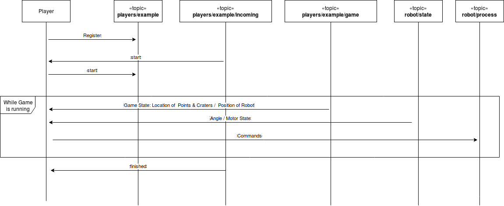

# Interface for Players

## Overview over the available topics

| Topic                             | Direction           | Description                             | Link                     |
| --------------------------------- | ------------------- | --------------------------------------- | ------------------------ |
| players/{your_team_name}          | PLAYER_TO_SERVER    | Register player and start games         | [Details](#game-master)  |
| players/{your_team_name}/incoming | SERVER_TO_PLAYER    | Listen if game starts or is finished    | [Details](#game-master)  |
| players/{your_team_name}/game     | SERVER_TO_PLAYER    | Get updates on currently running game   | [Details](#game-state)   |
| robot/state                       | SERVER_TO_PLAYER    | Get current state of robot              | [Details](#robot-state)  |
| robot/process                     | PLAYER_TO_SERVER    | Send commands to robot                  | [Details](#robot-control)|
| robot/done                        | SERVER_TO_PLAYER    | Processed commands by the robot         | [Details](#robot-done)   |
| robot/error                       | SERVER_TO_PLAYER    | Processing errors form the robot        | [Details](#robot-error)  |


## Sequence of a game
Before a game starts, you have to register yourself as a player. You do this by sending a
registration message to the topic `players/{teamname}`. The following example uses the
team name `example`. After negotiating the start of the game the game begins and you
receive messages on `players/example/game`.
It's now your turn to control the robot via messages on the `robot/process` topic. After the
game finished you receive a message on `players/example/incoming`.




## <a name="game-master"></a> Communication with the game master

### Registration

To register as a team, you need to send this message to the queue `players/{your teamname}`:

```json
{"command": "register", "args": []}
```

You can send this message every time you connect.

### Game start negotiation

When the game master decides that you are next to play you receive this message
on `players/{your teamname}/incoming`:

```json
{"command": "start", "args": []}
```

If you are ready, you can send the same message back on `players/{your teamname}`:

```json
{"command": "start", "args": []}
```

The gamemaster now starts a new game for you!

### <a name="game-state"></a> Game state

When you are in a running game, you receive the state of the game on the topic
`players/{your teamname}`:

```json
{
    "robot": {"r": 15, "x": 920.0, "y": 750.0},
    "world": {"y_max": 960, "x_max": 1920},
    "points": [
      {"collected": false, "r": 5, "x": 908, "score": 1, "y": 831}
    ]
}
```

> __Note__: Supply items have a score of _1_ and craters a score of _-1_. 

## Robot

### <a name="robot-state"></a> Receive state of hardware

The robot will send the current state of the gryro sensor (angle) and the position of the left and right motor to the topic _'robot/state'_. The angle is in degree the robot has turned. The value of the left_motor and right_motor ist the position of the motor in tacho counts.

```json
{"angle": 100, "left_motor": -143, "right_motor": 345}
```

### <a name="robot-control"></a> Control the robot

With the topic _robot/process_  you can send command to the robot.

> __Note:__ you can add additional attributes to the message like a message id. The attributes will also be shown in the processed messages in the '_robot/done_' topic.


Drive forward

```json
{"command": "forward", "args": [100]}
```

Drive backward

```json
{"command": "backward", "args": [100]}
```

Left turn

```json
{"command": "left", "args": [90]}
```

Right turn

```json
{"command": "right", "args": [90]}
```

Stop

```json
{"command": "stop"}
```

Reset hardware sensors (gyro and motor)

```json
{"command": "reset"}
```

### <a name="robot-done"></a> Processed commands
All processed commands will be sent back to the _'robot/done'_ topic.

### <a name="robot-error"></a> Processing errors
All processing errors of the robot are send to the _'robot/error'_ topic.
