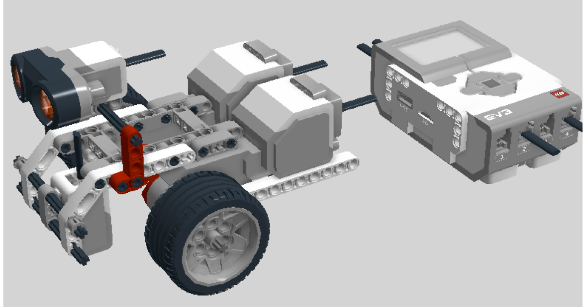
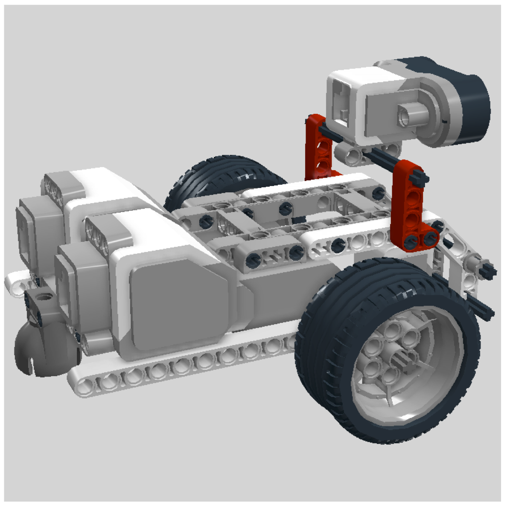

# Supported frameworks
Here you find the example code for the different frameworks and programming languages, which are supported for the challenge.

|  Language | Framework  | Release | Kernel | Example Tested  | Note | Supported by us during the challenge  |
|---|---|---|---|---|---|---|
| JavaScript (Node.js)  | ev3dev-lang-js  | ev3dev-jessie-2016-10-17 | 4.4.24-16-ev3dev-ev3 | _OK!_  | Recommend by ev3dev | yes!|
|  Python |  ev3dev-lang-python | ev3dev-jessie-2016-10-17| 4.4.24-16-ev3dev-ev3 | _OK!_ | Recommend by ev3dev |yes!|
|  Java |  ev3dev-lang-java | ev3dev-jessie-2016-10-17| 4.4.24-16-ev3dev-ev3 | _OK!_ | The ev3-dev-lang API is not fully supported. Some workarounds are required. |yes!|
|  Groovy |  ev3dev-jessie-2016-10-1 | 4.4.24-16-ev3dev-ev3 | 4.4.24-16-ev3dev-ev3 | _OK!_ | Uses the ev3dev-lang-java package. The ev3-dev-lang API is not fully supported. Some workarounds are required.|yes!|
|  Bash |  - | ev3dev-jessie-2016-10-17| 4.4.24-16-ev3dev-ev3 | _OK!_ | More like a PoC, difficult to program a robot. | yes!|
|  C++ |  ev3dev-lang-cpp |  -| - | - | - |no!|
|  C |  ev3dev-c |  -| - | - | - |no!|
|  go |  ev3go |  -| - | - | - |no!|

## Robot building instruction

To run the code examples you must connect the following components:
- Right motor (EV3 large motor) -> Output pin A
- Left motor (EV3 large motor) -> Output pin B
- Ultrasonic sensor -> Input pin 1
- Color sensor -> Input pin 4

__Note:__ You robot might look something like this. Keep in mind when you robot has a different shape, 
the code might be adapted to your own layout.

## Performance
In the performance test we measured how long it take to start a simple program (print a message to the console) 
on the ev3dev platform (Kernel 3.16.7-ckt21-9-ev3dev-ev3) with the different programming languages.

|Language|Version|Performance (Start up time)|
|---|---|---|
|Bash|-|133 msec|
|Python|2.7.9|887 msec|
|Node.js|v0.10.29|5974 msec|
|Java|1.7.0_60|4465 msec|
|Groovy|2.4.7|64455 msec|

## Reference
- libraries, http://www.ev3dev.org/docs/libraries/
- ev3dev releases, https://github.com/ev3dev/ev3dev/releases

